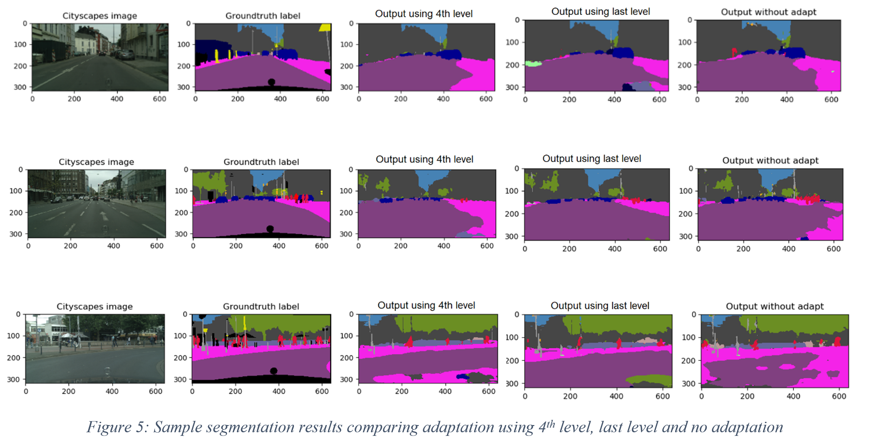

# Synthetic-to-real semantic segmentation
Perform Synthetic-to-real semantic segmentation.
Method is inspired from the paper	"Learning to Adapt Structured Output Space for Semantic Segmentation"

https://arxiv.org/abs/1802.10349

